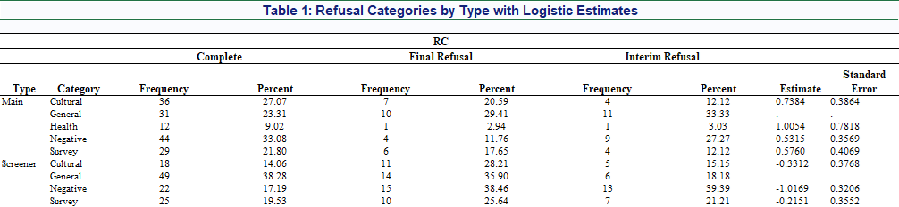

# Refusal Analysis

This repository contains the SAS script, dataset, and output tables used to analyze refusal patterns from survey data.  
The analysis focuses on identifying the association between refusal types, demographic/geographic factors, and interview phases using frequency distributions and multinomial logistic regression.

---

## 📊 Analysis Overview

The analysis produces:

1. **Table 1** – Refusal categories by type (Screener/Main) with frequency counts, row percentages, and logistic regression parameter estimates.  
2. **Table 2** – Screener interview multinomial logistic regression results showing parameter estimates and standard errors for predictor variables.  
3. **Table 3** – Main interview multinomial logistic regression results showing parameter estimates and standard errors for predictor variables.

---

## 📷 Sample Output Preview

Below is a preview of **Table 1** from the analysis:

---

## 🛠 Methodology

The SAS script:
- Imports the dataset from `Refusal_Data.xlsx`.
- Applies data cleaning and formatting.
- Generates summary tables using `PROC FREQ` and `PROC REPORT`.
- Runs multinomial logistic regression models (`PROC LOGISTIC`) to assess relationships between predictors and refusal outcomes.
- Outputs formatted tables to both Excel and RTF formats.

---

## 📋 Requirements

- **Software:** SAS 9.4 or later  
- **Input:** `Refusal_Data.xlsx` (included in repository)  
- **Output:** Formatted tables in Excel (`refusal_analysis_tables.xlsx`) and optionally RTF.

---

## ▶️ How to Run

1. Open `refusal_analysis.sas` in SAS.
2. Update file paths in the script if necessary.
3. Run the script to generate:
   - `refusal_analysis_tables.xlsx`
   - `refusal_analysis_tables.rtf` (optional)

---

## 📜 Reference

This analysis is based on the following publication:

> Hyder, S., Bilal, L., Mneimneh, Z., **Naseem, M. T.**, DeVol, E., Aradati, M., Shahab, M., BinMuammar, A., Al-Subaie, A., Al-Habeeb, A., & Altwaijri, Y. (2021). *Content Analysis and Predicting Survey Refusal: What Are Respondents’ Concerns about Participating in a Face-to-face Household Mental Health Survey?* **Field Methods**, 33(4), 377–394.  
> [https://doi.org/10.1177/1525822x211000856](https://doi.org/10.1177/1525822x211000856)

Please cite this paper if you use the code, methodology, or dataset structure from this repository.

---

## 📧 Contact

For questions or collaboration requests:
- **Author:** Mohammad Talal Naseem  
- **Email:** talal_naseem@hotmail.com  
- **LinkedIn:** [linkedin.com/in/mohammad-talal-naseem](https://linkedin.com/in/mohammad-talal-naseem)
